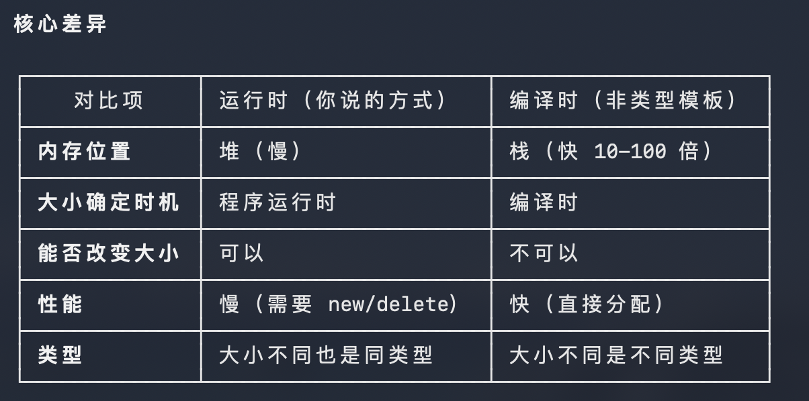

## 1 day
堆栈的概念
一.堆heap:杂乱的一堆的就就像是内存空间一样,数据是随机地址放入的.所以很大但是要手动的申请地址,不用数据的时候还要销毁对比与stack来说速度是慢的,stack是自动管理的,heap需要手动管理,stack通常只有几M
## 2 day
一.变量
在现代CPP中初始变量使用{},原因是有一下几点
1.统一的风格
2.防止数据窄化,防止发生隐士转换
3.当数据类型不完全匹配的时候编译器会报错
只有初始化的时候用,当赋值的时候不要用
二.int符号与字节数
seizeof(int) 4个字节 
sizeof(signed int) 4个字节
sizeof(short short) 2 个字节
sizeof(signed short) 2个字节
sizeof(long int) 4个字节
sizeof(long long) 8个字节
int = signed int;
虽然 win下long = int = 4位,因为c++会涉及跨平台所以不同平台的long表示的位数是不一样的
这是一个历史遗留的问题
三.小数
下面都是二进制的方式
1.float 32位
1位表示 正负
8位表示指数 
23位表示有效值,换算成10进制大约7位,7位指的是从个开始算

  ---
  📊 对比图表

  ┌──────────────────────┬──────────────────┬───────────┬─────────────────┐
  │         特性         │      const       │ constexpr │    constinit    │
  ├──────────────────────┼──────────────────┼───────────┼─────────────────┤
  │ 什么时候初始化？      │ 运行时（可能晚）   │ 编译时    │ 编译时           │
  ├──────────────────────┼──────────────────┼───────────┼─────────────────┤
  │ 初始化后能改吗？      │ ❌ 不能          │ ❌ 不能   │ ✅ 可以         │
  ├──────────────────────┼──────────────────┼───────────┼─────────────────┤
  │ 必须用常量初始化？    │ ❌ 不一定         │ ✅ 必须   │ ✅ 必须        |
  ├──────────────────────┼──────────────────┼───────────┼─────────────────┤
  │ 解决初始化顺序问题？  │ ❌ 不能           │ ✅ 可以   │ ✅ 专门为此设计 │
  └──────────────────────┴──────────────────┴───────────┴─────────────────┘

  ---
  ## 3 day
  一.进制
  1.2进制: 0b开头;在控台中二进制显示使用<bitset>头文件 std::bitset<sizeof(int)*8>(变量名)
  2.8进制 :0开头,std::oct 显示八进制
  3.10进制:正常开头,std::dec 显示十进制
  4.16进制:0x开头,std::hex 显示16进制,
  1111 = 0xF ; 
  1111 1111 = 0xFF ; 计算 0xff = 0b1111 1111 = 0377(3*(8^2)+7*(8^1)+7*(8^0)) = 255=(15*(16^1)+15*(16^0))
  ## 4 day
  1.关于位运算
  按位 与或非(& | ~)异或(^) ; 
  按位运算底层都将不同进制的数值转化为二进制进行的;
  2.位运算的使用场景
  按位运算的常用场景:UE中常表示状态和权限的设置或者叠加,碰撞通道的设置,颜色通带的设置,渲染模式设置,文件的打包压缩
  3.位运算实际案例

    constexpr unsigned short int Perm_Move {1<<0}; // 0x1
    constexpr unsigned short int Perm_Attact {1<<1};//0x2
    constexpr unsigned short int Perm_Use{1<<2}; // 0x4;
    constexpr unsigned short int Perm_Chat{1<<3}; // 0x8
    constexpr unsigned short int Perm_Admin{1<<4}; //0x10;
        
struct PermissionInfo 
    {
        unsigned int flag;
        std::string name;
    };
 class  Character 
    {
    private:
        unsigned short int Permission;
        const std::vector<PermissionInfo> PermissionList
        {
            {Perm_Move,"移动权限"},
            {Perm_Attact,"攻击权限"},
            {Perm_Use,"使用权限"},
            {Perm_Chat,"通信权限"},
            {Perm_Admin,"管理权限"},
    
        };
    public:
        Character():Permission{0}{};
        void GrantPermission(unsigned short int Prom)
        {
            Permission|=Prom;
            std::cout<<std::setw(20)<<"给所有权限:"<<std::bitset<sizeof(unsigned short int)*8>(Permission)<<std::endl;
             std::cout<<std::setw(20)<<"给所有权限:"<<std::dec<<Permission<<std::endl;
        }
        void RemovePermission (unsigned short int prom)
        {
            Permission &=(~prom);
            std::cout<<std::setw(20)<<"移除权限:"<<std::bitset<sizeof(unsigned short int)*8>(Permission)<<std::endl;
            std::cout<<std::setw(20)<<"给所有权限:"<<std::dec<<Permission<<std::endl;
        }
        bool HasPermission(unsigned int perm) const 
        {
          return (Permission & perm) != 0;
        }
        void GetStatue()
        {
            if (!Permission)
            {
                std::cout<<std::setw(20)<<"当前权限全关"<<std::endl;
            }else 
            {
                for (const auto& Perm : PermissionList)
                {
                     if (HasPermission(Perm.flag))
                     {
                       std::cout<< Perm.name<<":[开启]"<<std::endl;
                     } else {std::cout<< Perm.name<<":[关闭]"<<std::endl;}
                     
                }
                      
            }
            std::cout<<std::setw(20)<<"当前权限:"<<std::bitset<sizeof(unsigned short int)*8>(Permission)<<std::endl;
        }
    };

 ## 5 day
 数组
 用一维数组的方式存储多维数组可以提升运行效力
 尽量不要使用数组的嵌套
 原因:
 1.多维数组容易造成内存的碎片化,不连续
 2.缓存未命中率高
 3.额外的指针开销
 4.内存碎片化
  多维数组内存布局示意：
  Row 0: [1][2][3][4] -> 分配在内存A
  Row 1: [5][6][7][8] -> 分配在内存B（可能很远）
  Row 2: [9][10][11][12] -> 分配在内存C
  多维数组如果内存不连续、碎片化 → CPU 一次预读的缓存里，有用的数据很少 → 大量缓存未命中。
  还有就是声明的变量,只要不是New的会放在栈上,win默认栈的大小是1M,如果嵌套数组很容易爆栈;
  补充:L1,L2,L3缓存是内存数据放入让CPU读取的地方,栈,堆,静态都是在RAM(随机记忆存储)内存上的
  ·L1/L2/L3 缓存 → CPU 内部，最快
  ·栈、堆、全局 → 都在内存条，速度一样
  ·栈快是因为连续、好缓存；
  ·堆慢是因为碎片化、难预测
  二维公式: 行*列总数+行数 = 二维所在的点位置
  三维公式: 页数* 总行数* 总列数 + 二维公式 = 页数* 总行数* 总列数 + 行数*总列数+列数
  5.std::size(数组,动态数组) = 元素数量

 ## 6 day
 指针
1.指针就是存贮地址的变量,指针=指针 其实就是 指针储存的地址发生了变化.
2.指针在不同系统中被定义的大小不一样,在64位中是8字节,在32位中是4字节.
3.指针申请内容用new , 数组申请内存 用new[]; 释放内存 delete,释放数组内存 delete[];
4.指针+1 = 指针存储的数据位移size(内部数据);指针数组可以通过这种方式进行遍历
int* PtrInt{new int[3]{1,2,3}} ;*(PtrInt+1) = 2;
5.悬空指针: 指针指向已经被释放的内存,指针还在内存释放; 内存泄露:指针找不到被申请的内存变量,内存还在指针被释放;
6.申请内存失败后不让抛出异常的做法: int* Pter = new(std::nothrow)int(2);
7.注意指针在作用域内被栈释放,从而造成内存泄漏

## 7 day
引用 References -是变量的别名 -是地址
引用 必须初始化不能为空 
引用 一旦绑定,不能帮等到其他变量
//引用与指针的区别对比
//何时选择指针?何时使用引用? 

## 8 day
字符串操作
std::string  capacity(容量) shrink_for_fit(缩放到何时容量) 
std::string_view
为什么而设计:防止当你传入一个字符串数组的时候发生 char[] → string 的拷贝
string_view 只是记录了字字符串数组的地址和字符串的数量,没有New 没有malloc
只是用来看;如果想让字符串打印地址字符串前面加上强转(const void*);这也编译器会认为他是一个地址(指针)\

## 9 day
1.问题:如果当一个函数的返回值为空的时候如何应对可能出现的
返回值 重定义 , 返回值为空指针导致的悬空指针, 通过Option表示返回值有或无的状态
设计目的：替代丑陋的特殊值、指针、输出参数，消除隐式错误，让代码语义清晰、安全、统一
std::optional 没有歧义
有值 = 找到了
无值 = 明确没找到
一看类型就知道函数意图
在UE中一般用于找东西的时候使用 有值找到了,没有值 没有找到
UE 里大量函数都是这种逻辑 全部都是：可能找到，可能找不到这就是 std::optional 诞生的唯一目的。
2.一般函数传入一个变量的时候使用const int& /其他类型 & 目的是当拷贝开销
当传入的对象特别大的时候,比如一个Actor,一个超级大的类的时候会产生巨大的开销,但是如果只是使用立面的数据
没必要产生一次拷贝;std::nullopt 是optional类型的空变量,他是临时产生的,当函数执行完毕后会自动销毁,
不会有悬空指针
3.以lyra的背包系统为例,Option是如何使用的
首先:了解lyra背包的构成
每个玩家拥有独立背包
背包 = TArray<FInventoryItemEntry>
条目结构体 = FGameplayTag（物品 ID） + int32 数量
全局物品模板 = DataAsset（唯一一份）背包会有一个指针 所有的背包都会指向同一个DA

结构 
使用道具
   ↓
调用背包函数：FindItemByTag(要使用的物品ID)
   ↓
函数内部遍历 TArray
   ↓
找到 ID 匹配 → 返回 TOptional(有值)
找不到 ID → 返回 TOptional(nullopt)
   ↓
判断 if (Result.IsSet())
   ↓
拿到条目 → 再判断 数量 > 0
   ↓
通过 ID 找到全局唯一 DA
   ↓
调用 DA 的 Use 函数（作用到角色）
   ↓
玩家背包数量 -1

## 10 day
1.函数重载:
最终给你一个最精炼正确版本
重载只看参数：类型、个数、顺序
返回值无关
值 / 引用 / 指针 都算不同类型，可以重载
顶层 const 不算重载(int/const int)(int& /const int )(int/cosnt int&)都不可以
底层 const（引用 / 指针带 const）算重载(int&/const int&)可以
只有参数完全一样才会重定义或调用二义性

## 11 day
1.静态变量:静态变量与全局变量的声明周期基本一致
全局变量的坏处:都可以用,乱,容易重名,
静态变量的好处:只能在当前的CPP的调用,不可以被其他调用,有限的方便+防止混乱的隔离作用
普通全局变量：整个程序都能用
static 全局变量：只有当前这个 .cpp 能用
生命周期一样，存储区一样，就是可见范围不一样。
2.内联函数
内联函数:是在编译时期,编译器将调用函数的位置 直接赋值函数,减少调用开销
内联函数在UE中经常使用:尤其是及高频次运算的时候
UE中使用内联要使用关键字FORCEINLINE; FORCEINLINE 是强制指令 ,因为要不要内联是编译器判断的
编译器可以拒绝内联
虚函数、递归、大函数 → 编译期无法 / 不会内联
3.递归
函数自己调用自己,当到达条件时结束
用递归的地方:递归的设计初衷，就是让 “自相似问题” 能用最简洁、最自然、最接近数学定义的方式实现，让系统自动处理调用栈，不用人手动管理。
## 12 day
关于VScode 和 编译器的 调试
1.关于函数执行时候的调用栈，总的来说，是先执行函数先进栈，后进入的函数后出栈，进栈的不是是函数的栈帧，
栈帧：函数执行的信息
  - 函数参数（复制的值）
  - 局部变量  
  - 返回地址（函数执行完后回到哪里）
  - 其他元数据
2.函数模版
首先搞清楚,当参数T& 的时候 其实传入进来的是 原本值的别名,并不是原本值的地址
还要注意一点,如果我定一了一个模版函数,返回的值类型不一致,编译器回进行一次拷贝,
即使我返回的是一个引用这也回导致悬空引用;
函数模版:
template <typename T>
const int& GetMax(const T& a,const T& b)
{
    return a>b?a:b;
}
函数模版特化:
template<>
const char* GetMax(const char* a,const char* b )
{
    return std::strcmp(a,b)>0?a:b;
}
3.decltpye 精准的返回类型推到
auto能推到出 int double char 之类的,无法推到出const & 之类的
decltpye 可以实现返回值类型的精准推到
auto作为返回值返回的时候回发生值考呗,但是 decltpye可是进行引用返回
  template<typenameT>                            
  decltype(auto) Test1(T& x) 
  { 
      return x;  // 返回值 
  }               
  template <typename T>
  decltype(auto) Test2(T& x) 
  {
      return (x);  // 返回引用          
  }                                                                            4.非类型模版
  template<typename T ,int U>
  在编译时起就确定传入什么样的数据类型,当我们进行声明函数的时候可是直接将数值传入,一般可以用作数组的大小赋值
  
   引用是变量的别名,比如 &ref = a ; 操作ref = 操作a ; 只有指针指向的是变量的地址
5.数据类型检查<type_tratis> 可以在编译时期检查
  std::is_integral<int>::value // 是特征类型
  std::is_class<std::string>::value // 是特征类型
  if constexpr(std::is_integral<T>::value)
6.requires(需要)限定模版可执行的类型
  - template <typename T> // 利用特征类型的检查
  requires std::is_integral<T>::value //bool值为true时才会实例化这个函数模板
  void RequiresInt(T a)
  {
    std::cout<<"调用了RequiresInt"<<std::endl;
    std::cout<<a<<std::endl;
  }
  - 利用概念的方式限定
  void RequiresInt(T a)
  {
    std::cout<<"调用了RequiresInt"<<std::endl;
    std::cout<<a<<std::endl;
  }
7.CPP20新增“概念”功能
std::integral / std::floating_point 等
还可以自定义概念,类class 一般自己来定义概念
自定义自己的概念 #include<concepts>
template<typename T>
concept MyConcept =  std::is_integral<T>::value
8.概念,类型限定的综合使用
## 13 Day
1.类
构造函数与析构函数
构造函数 = default 默认执行的构造函数 ; 不能添加参数,就是编译器默认无参执行的构造函数
构造函数与析构函数的调用顺序
先构造的类构造函数限制性,但是析构函数后执行,后构造的类,析构函数先执行;
this指针,返回的是类自己的地址,用来内部调用函数
this可以实现链式调用,调用一个返回自己的指针,可以通过链接调用的函数实现
结构体一般用来放成员变量不放方法,class 放方法和类成员变量
类对象的大小:
将类的成员类型的大小加起来,函数不记录对象大小,函数与类是无关的,
2.类对象 与 const之间的关系
