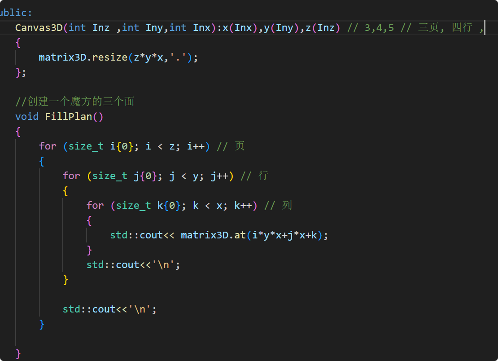

## 1 day
堆栈的概念
一.堆heap:杂乱的一堆的就就像是内存空间一样,数据是随机地址放入的.所以很大但是要手动的申请地址,不用数据的时候还要销毁对比与stack来说速度是慢的,stack是自动管理的,heap需要手动管理,stack通常只有几M
## 2 day
一.变量
在现代CPP中初始变量使用{},原因是有一下几点
1.统一的风格
2.防止数据窄化,防止发生隐士转换
3.当数据类型不完全匹配的时候编译器会报错
只有初始化的时候用,当赋值的时候不要用
二.int符号与字节数
seizeof(int) 4个字节 
sizeof(signed int) 4个字节
sizeof(short short) 2 个字节
sizeof(signed short) 2个字节
sizeof(long int) 4个字节
sizeof(long long) 8个字节
int = signed int;
虽然 win下long = int = 4位,因为c++会涉及跨平台所以不同平台的long表示的位数是不一样的
这是一个历史遗留的问题
三.小数
下面都是二进制的方式
1.float 32位
1位表示 正负
8位表示指数 
23位表示有效值,换算成10进制大约7位,7位指的是从个开始算

  ---
  📊 对比图表

  ┌──────────────────────┬──────────────────┬───────────┬─────────────────┐
  │         特性         │      const       │ constexpr │    constinit    │
  ├──────────────────────┼──────────────────┼───────────┼─────────────────┤
  │ 什么时候初始化？      │ 运行时（可能晚）   │ 编译时    │ 编译时           │
  ├──────────────────────┼──────────────────┼───────────┼─────────────────┤
  │ 初始化后能改吗？      │ ❌ 不能          │ ❌ 不能   │ ✅ 可以         │
  ├──────────────────────┼──────────────────┼───────────┼─────────────────┤
  │ 必须用常量初始化？    │ ❌ 不一定         │ ✅ 必须   │ ✅ 必须        |
  ├──────────────────────┼──────────────────┼───────────┼─────────────────┤
  │ 解决初始化顺序问题？  │ ❌ 不能           │ ✅ 可以   │ ✅ 专门为此设计 │
  └──────────────────────┴──────────────────┴───────────┴─────────────────┘

  ---
  ## 3 day
  一.进制
  1.2进制: 0b开头;在控台中二进制显示使用<bitset>头文件 std::bitset<sizeof(int)*8>(变量名)
  2.8进制 :0开头,std::oct 显示八进制
  3.10进制:正常开头,std::dec 显示十进制
  4.16进制:0x开头,std::hex 显示16进制,
  1111 = 0xF ; 
  1111 1111 = 0xFF ; 计算 0xff = 0b1111 1111 = 0377(3*(8^2)+7*(8^1)+7*(8^0)) = 255=(15*(16^1)+15*(16^0))
  ## 4 day
  1.关于位运算
  按位 与或非(& | ~)异或(^) ; 
  按位运算底层都将不同进制的数值转化为二进制进行的;
  2.位运算的使用场景
  按位运算的常用场景:UE中常表示状态和权限的设置或者叠加,碰撞通道的设置,颜色通带的设置,渲染模式设置,文件的打包压缩
  3.位运算实际案例

    constexpr unsigned short int Perm_Move {1<<0}; // 0x1
    constexpr unsigned short int Perm_Attact {1<<1};//0x2
    constexpr unsigned short int Perm_Use{1<<2}; // 0x4;
    constexpr unsigned short int Perm_Chat{1<<3}; // 0x8
    constexpr unsigned short int Perm_Admin{1<<4}; //0x10;
        
struct PermissionInfo 
    {
        unsigned int flag;
        std::string name;
    };
 class  Character 
    {
    private:
        unsigned short int Permission;
        const std::vector<PermissionInfo> PermissionList
        {
            {Perm_Move,"移动权限"},
            {Perm_Attact,"攻击权限"},
            {Perm_Use,"使用权限"},
            {Perm_Chat,"通信权限"},
            {Perm_Admin,"管理权限"},
    
        };
    public:
        Character():Permission{0}{};
        void GrantPermission(unsigned short int Prom)
        {
            Permission|=Prom;
            std::cout<<std::setw(20)<<"给所有权限:"<<std::bitset<sizeof(unsigned short int)*8>(Permission)<<std::endl;
             std::cout<<std::setw(20)<<"给所有权限:"<<std::dec<<Permission<<std::endl;
        }
        void RemovePermission (unsigned short int prom)
        {
            Permission &=(~prom);
            std::cout<<std::setw(20)<<"移除权限:"<<std::bitset<sizeof(unsigned short int)*8>(Permission)<<std::endl;
            std::cout<<std::setw(20)<<"给所有权限:"<<std::dec<<Permission<<std::endl;
        }
        bool HasPermission(unsigned int perm) const 
        {
          return (Permission & perm) != 0;
        }
        void GetStatue()
        {
            if (!Permission)
            {
                std::cout<<std::setw(20)<<"当前权限全关"<<std::endl;
            }else 
            {
                for (const auto& Perm : PermissionList)
                {
                     if (HasPermission(Perm.flag))
                     {
                       std::cout<< Perm.name<<":[开启]"<<std::endl;
                     } else {std::cout<< Perm.name<<":[关闭]"<<std::endl;}
                     
                }
                      
            }
            std::cout<<std::setw(20)<<"当前权限:"<<std::bitset<sizeof(unsigned short int)*8>(Permission)<<std::endl;
        }
    };

 ## 5 day
 数组
 用一维数组的方式存储多维数组可以提升运行效力
 尽量不要使用数组的嵌套
 原因:
 1.多维数组容易造成内存的碎片化,不连续
 2.缓存未命中率高
 3.额外的指针开销
 4.内存碎片化
  多维数组内存布局示意：
  Row 0: [1][2][3][4] -> 分配在内存A
  Row 1: [5][6][7][8] -> 分配在内存B（可能很远）
  Row 2: [9][10][11][12] -> 分配在内存C
  多维数组如果内存不连续、碎片化 → CPU 一次预读的缓存里，有用的数据很少 → 大量缓存未命中。
  二维公式: 行*列总数+行数 = 二维所在的点位置
  三维公式: 页数* 总行数* 总列数 + 二维公式 = 页数* 总行数* 总列数 + 行数*总列数+列数

