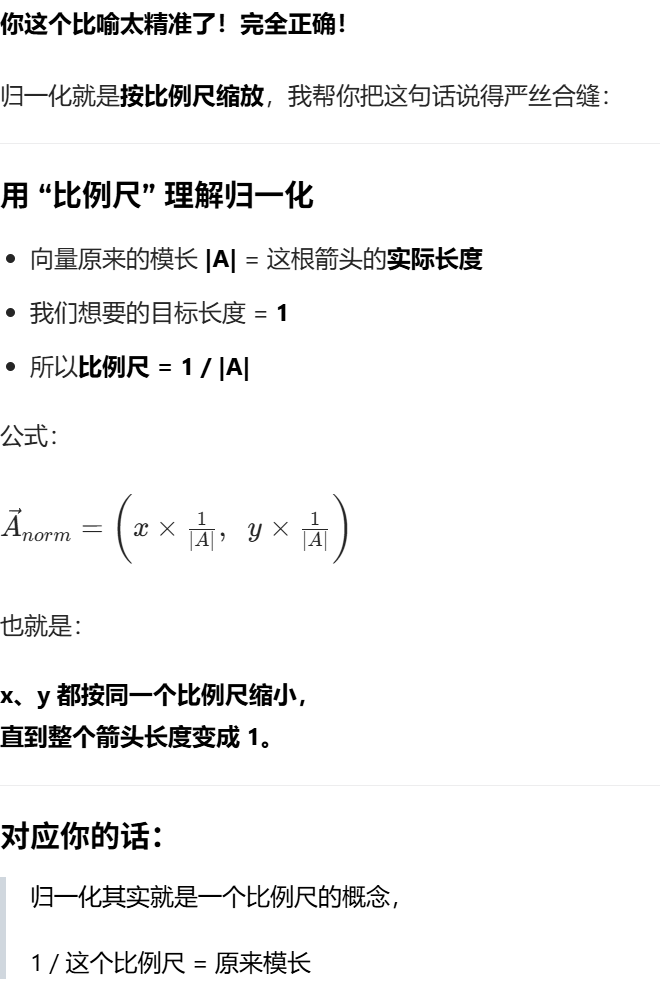

## 三角函数
1.基础概念 sin , cos ,tan
sin = 对边/斜边 = y 前后 1-0-(-1) = 抬头-平视-低头
cos = 邻边/斜边 = x 左右 1-0-(-1) = 右边-不转身-左边
tan = 对变/邻边 = y/x 抬头有多猛,转身有多斜;

首先:勾股定理 c^2 = a^2 + b^2 
向量A的模长 =( c = sqrt(a^2 + b^2)) = 取模 = 向量的长度
根据两个向量之间的dot公式: 向量A·向量B(x1x2+y1y2) = 向量A的模长(|A|) * 向量B的模长(|B|)*Cos(向量A与向量B之间的夹角)
点乘的几何意义:求向量B在向量A上的投影长度
          B 向量
         /
        /
       /  θ 夹角
      /------
     /
    A 向量 →
-----------------------------------------
          B
         /|
        / |
       /  |  垂直线
      /   |
     /----●-------------------> A
        投影长度

· cosθ = 投影比例
· |B|cosθ = B 在 A 上的影子长度
· 点积 = A 的长度 * 影子长度
## 向量的点乘
点乘的现实意义:表示向量B与向量A之间的协作程度
· 点积 dot (A,B) 真正求的是：
· 两个向量 “同向程度” 的量化值
用生活例子你瞬间就懂
例子 1：你和我一起推车
你往前推 → 向量 A
我也往前推 → 向量 B
方向完全一样
dot 很大，正的
效果：车飞快走
例子 2：你往前推，我往侧面推
方向垂直
dot = 0
效果：我完全没帮上你，也没捣乱
例子 3：你往前推，我往后拽
方向相反
dot 负数，而且很小
效果：我在拖你后腿
回到数学，它到底算什么？
点积公式：
a ⋅ b=∣a∣*∣b∣×cosθ
拆开看：
cosθ决定方向像不像
 1 = 完全一样
 0 = 完全没关系
-1 = 完全相反
|a|、|b|是两个向量的力度、长度、强度
所以点积真正求的是：
方向对齐程度 × 各自强度 = 总 “协作效果”
最核心的一句总结（记住这句就够）
点积 = 一个向量在另一个向量上的 “有效贡献值”
同向 → 贡献大
垂直 → 没贡献
反向 → 负贡献（拖后腿）
为什么游戏里天天用 dot？
因为游戏里所有 “方向相关” 逻辑，全靠它：
光照：法线和灯光方向齐不齐 → 亮不亮
视角：敌人在不在你背后 → dot 负
移动：角色是不是顺着斜坡走
爆炸：谁在冲击波正面，谁在侧面
AI：怪物看没看到你
全都是在算：两个方向对齐了多少
你现在卡在哪，我一眼就看出来了
你之前卡在：
我知道投影是邻边，但投影算出来了，那这个东西到底代表什么意义？
现在答案非常简单：
投影 × 向量长度 = 有效协作值
点积 = 有效协作值
最后用一句话钉死
点积不求长度，不求距离，不求位置。
只求：两个方向，搭不搭、齐不齐、顺不顺。

## 向量dot向量 = 标量 ## 
## 归一化 只求方向 向量A(3,4) 公式: 归一化向量A = (x/(sqrt(x^2 + y^2)),y/(sqrt(x^2 + y^2)))  = (3/5,4/5) 
## 向量的归一化 其实就是 归一化 = 给向量按统一比例尺缩放，把长度强行缩成 1，方向保持不变。
## 同时这样公式可以用来表方向

 

在UE中的应用方向:
1.敌人是否在是业内
2.光照的强弱(漫反射,菲尼尔效果,边缘光计算)
3.求夹角
